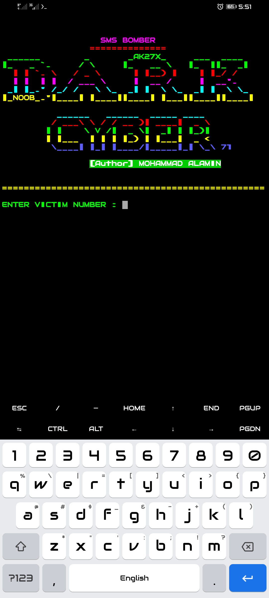

<h1 align="center">
☆ᴍᴏʜᴀᴍᴍᴀᴅ ᴀʟᴀᴍɪɴ☆
</h1>

<h2 align="center">
INBOX FU*KER
</h2>

 

 

 

 

<h2 align="center">☆[INFORMATION]☆</h2>

* XBOMBER 5K SENDING  Thanks For Using. 

<h3 align="center">☆[INSTALL]☆</h3>

*`
pkg update && upgrade -y
`

*`
pkg install git -y
`

*`
git clone https://github.com/AK27X/XBOMB
`

*`
pkg install python -y
`

<h5 align="center">☆[RUN]☆</h5>

*`
cd XBOMB
`

*`
python x
`

  

<h4 align="center">☆[UNINSTALL]☆<h4>

*`
rm -rf XBOMB
`

<h6 align="center">
☆USERNAME & PASSWORD☆
</h5>

